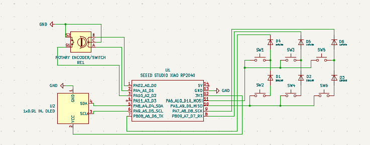
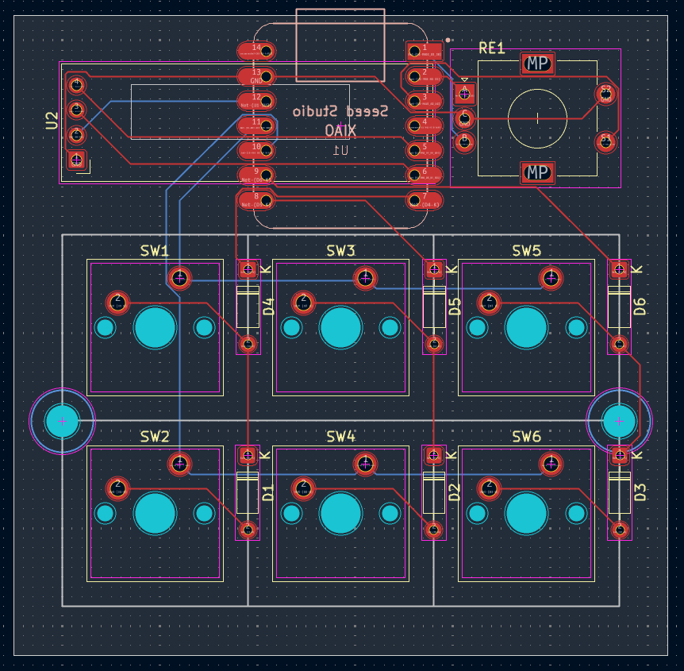
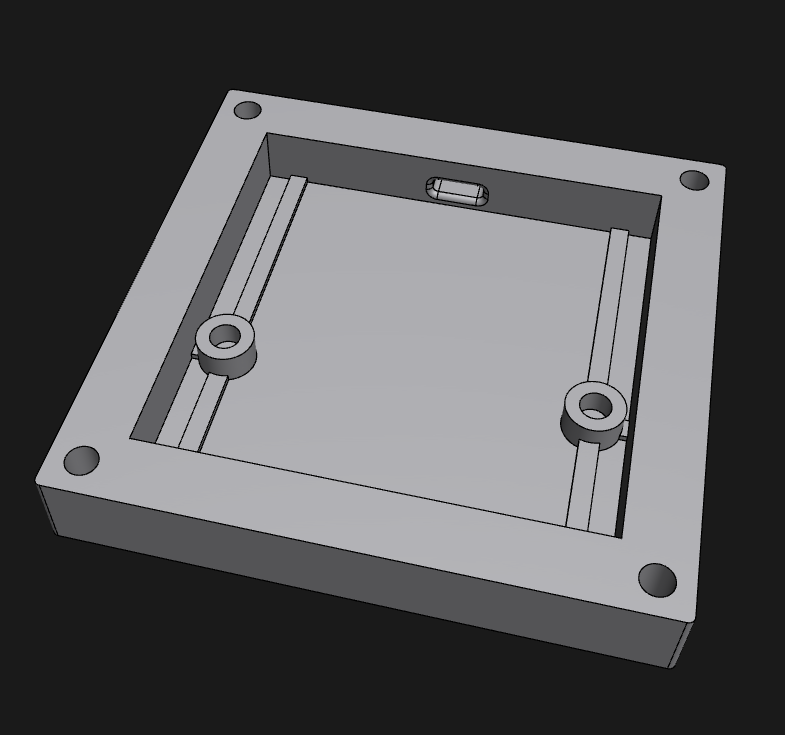
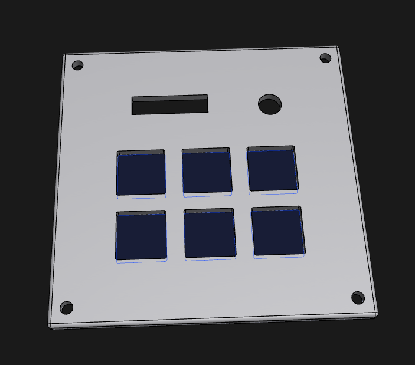

# PCC (Physical Control Center)

PCC is a macropad with six keys and a rotary encoder. I designed it to control things like my PC's volume and media playback (hence the "Physical Control Center" name) but you can build a new firmware to map the keys to do anything, really.

Designed for Hack Club's Hackpad program. (view it [here](https://hackpad.hackclub.com))

## Disclaimer!

I haven't recieved my PCB or kit from Hack Club as of yet, so both the case and firmware code are not guaranteed to work with this macropad on the first try (the case may not fit, the firmware may reference a key that doesn't exist, I don't know). Obviously once I recieve everthing I will fix any problems that should arise, but until then, continue cautiously.

## Case

The case is in two parts, held together with screws driven through holes in the top case's corners. All screws in the case screw into heat-set inserts, so to allow easier disassembly, if that's something you'll need.

## Firmware

KMK firmware is used for this macropad, though I'm sure you could make a QMK version if you so please. I chose KMK since it uses Python though. View the firmware code [here.](https://github.com/wintermute-zion/PCC/blob/main/production/main.py)

## Pinouts

### Key Matrix

| Row/Column | Digital GPIO Pin | GPIO Pin |
| ---------- | ---------------- | -------- |
| Row 1      | D10              | GPIO3    |
| Row 2      | D9               | GPIO4    |
| Column 1   | D6               | GPIO0    |
| Column 2   | D7               | GPIO1    |
| Column 3   | D8               | GPIO2    |

### Rotary Encoder

| Pin | Digital GPIO Pin | GPIO Pin |
| --- | ---------------- | -------- |
| A   | D1               | GPIO27   |
| B   | D0               | GPIO26   |
| S1  | D2               | GPIO28   |

## Key Map

### Key Matrix

|       | Column 1             | Column 2         | Column 3           |
| ----- | -------------------- | ---------------- | ------------------ |
| Row 1 | Play/Pause Media     | Stop Track (Win) | Show Desktop (Win) |
| Row 2 | Previous Track (Win) | Next Track (Win) | Lock PC (Win)      |

### Rotrary Encoder

|                  |             |
| ---------------- | ----------- |
| Knob turn left   | Volume Down |
| Knob turn right  | Volume Up   |
| Knob button push | Audio Mute  |

## BOM

A list of everything you'd need to build this. You can view this as a .csv file [here.]()

- (1) Seeed Studio XIAO RP2040 MCU
- (6) Cherry MX keyboard switches
- (1) EC11 rotary encoder
- (6) 1N4148 diodes
- (6) M3 x 5mm x 4mm heatset inserts
- (6) M3 x 16mm screws
- (6) Keycaps
- (1) Custom PCB
- (1) Case bottom
- (1) Case top
